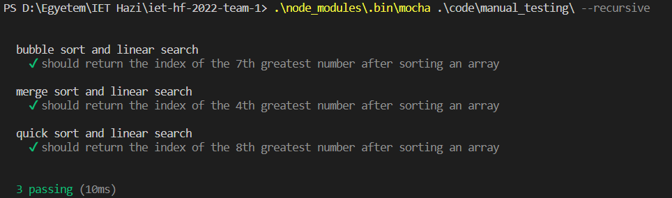
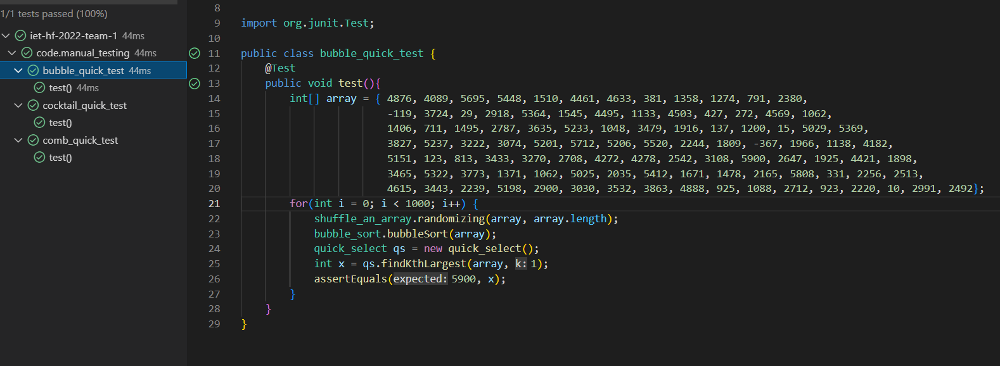

# Manual Testing
A manuális tesztelés során funkcionális teszteket készítettünk. Megnéztünk néhány Sort, Search és Select függvényt, hogy az egymástól átvett adattal is helyes-e a működésük, azaz valóban felhasználhatók-e a gyakorlatban. Két nyelven is kipróbáltuk az algoritmusosztályokat, hogy nagyobb fedésünk legyen a kódbázison.
## Tömbök rendezése, majd választás index szerint Java algoritmusok használatával
Három tesztet készítettünk Java nyelven:

- bubble_quick_test.java
- cocktail_quick_test.java
- comb_quick_test.java

Először is importálni kellett az org.junit package-t, hogy tudjunk tesztelni. Az algoritmusok fájlain annyit változtattunk, hogy beleraktuk az osztályokat egy package-be, hogy be tudjuk importálni a teszteknél és tudjuk használni őket. Néhol a class nevét is meg kellett változtatni a fájl nevére. Volt ahol a statikus függvényt kellett használni, néhol példányosítani kellett az osztályt és annak a bizonyos függvényét meghívni.

bubble_quick_test.java: 
Generáltunk egy random tömböt, majd ezt egy for ciklusban, 1000-szer összekevertük az elemeit(Shuffle an array), rendeztük(Bubble sort) és végül kiválasztottuk a legnagyobb elemét(Quick select), majd asserteltük, hogy tényleg az a legnagyobb elem-e.

cocktail_quick_test.java: 
Generáltunk egy random tömböt, majd ezt egy for ciklusban, 1000-szer összekevertük az elemeit(Shuffle an array), rendeztük(Cocktail sort) és végül kiválasztottuk a legnagyobb elemét(Quick select), majd asserteltük, hogy tényleg az a legnagyobb elem-e.

comb_quick_test.java: 
Generáltunk egy random tömböt, majd ezt egy for ciklusban, 1000-szer összekevertük az elemeit(Shuffle an array), rendeztük(Comb sort) és végül kiválasztottuk a legkisebb elemét(Quick select), majd asserteltük, hogy tényleg az a legkisebb elem-e.

## Tömbök rendezése, majd választás index szerint JavaScript algoritmusok használatával
Három tesztet készítettünk JavaScript nyelven:

- bubble_linear_test.js
- merge_linear_test.js
- quick_linear_test.js

Letöltöttük egy node.js-t, majd a mocha segítségével teszteltünk. Néhol át kellett írni a javascript fájlokat, exportálhatóvá kellett tenni az osztályokat, hogy importálhassuk őket a tesztekhez. Tömb amelyet, használunk: [5, 8, 0, 2, 7, 1, 4, 3, 9, 6], azért kényelmes, mert a rendezés után az indexnek meg kell felelnie az értékkel.

bubble_linear_test.js:
A Bubble sort segítségével rendezünk egy tömböt, majd kiválasztjuk a Linear Search segítségével, hogy a 3-as szám hányadik indexen van és teszteljük, hogy valóban a 3. indexen van.

merge_linear_test.js:
A Merge sort segítségével rendezünk egy tömböt, majd kiválasztjuk a Linear Search segítségével, hogy a 6-os szám hányadik indexen van és teszteljük, hogy valóban a 6. indexen van.

quick_linear_test.js:
A Quick sort segítségével rendezünk egy tömböt, majd kiválasztjuk a Linear Search segítségével, hogy a 2-es szám hányadik indexen van és teszteljük, hogy valóban a 2. indexen van.

A többi Java teszt ezzel analóg, ugyanúgy egy 100 elemű tömböt 1000-szer rendezünk, kiválasztjuk egyik elemét, és megvizsgáljuk helyes-e.