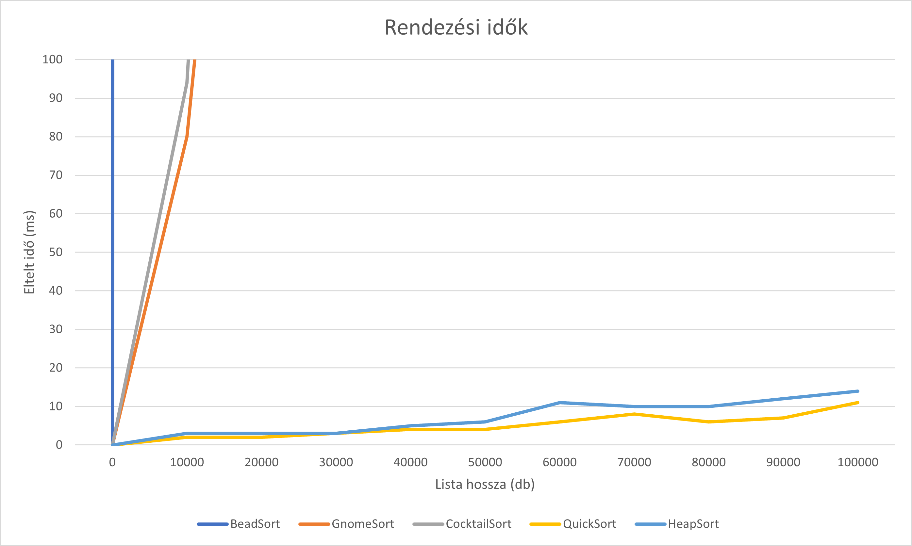
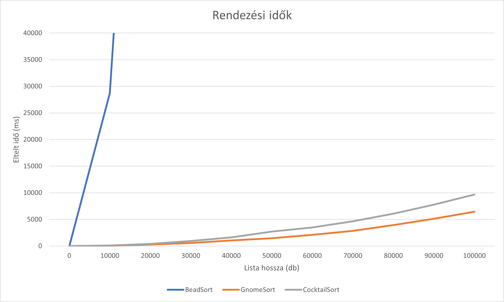

# Nem-funkcionális tesztek eredményei
## Sudoku-solver
### Használhatóság

A probléma megoldásához felhasználtam a könyvtár által tartalmazott példakódot kisebb módosításokkal.
A használhatóság ellenőrzésére először egy 9x9-es sudoku táblával próbáltam ki az algoritmust, ami megfelelően le is futott.
Miután egy kész sudokut adtam oda az algoritmusnak helyesen nem kezdett vele semmit.
Ha egy érvénytelen sudoku táblát adunk oda a programnak akkor helyesen jelzi, hogy az adott sudoku nem megoldható, viszont egy kész, hibás sudokura már nem jelzi, hogy az adott sudoku érvénytelen.
Továbbá az algoritmusban nincs lekezelve az, ha negatív számot is tartalmaz a lista. Úgy fut le mintha az a szám nemnegatív lenne.
A negatívumok közés orolható az a tény is, hogy az algoritmus nem hasznbálható 16x16-os sudoku rejtvények megoldására és 6x6-os sudokure sem működik, mivel az algoritmus feltételezi azt, hogy az összetartozó mezők négyzetek.
Ezektől a problémáktól eltekintve az algoritmus jól használható.

### Teljesítmény

Az algoritmus teljesítményének a mérésére az algoritmus futási idejét vizsgáltam.
Különböző nehézségű és nagyságú sudokuk esetében mértem a lefutási időt.
A lefutási idő különböző nehézségű sudokuk esetében alig észrevehető, viszont minnél kisebb méretű az adott sudoku annál gyorsabban fut le az algoritmus.
Mivel a 9x9es méret a legnagyobb ami megadható, így az algoritmus lefutási ideje mindig rövid.

## Bead sort

### Használhatóság

A tesztekhez felhasználtam a könyvtár által tartalmazott példakódot kisebb módosításokkal.
A teszt eredménye alapján megállapítottam, hogy az algoritmus felhasználható.
Ez az algoritmus feltételezi, hogy pozitív számokat rendez, a negatív inputokat kicseréli 0-ra így az algoritmus nem dob hibát.

### Teljesítmény

[Lásd itt.](#Nem-funkcionális-tesztek-eredményei)

## A tesztelt rendező algoritmusok összehasonlítása

### Teljesítmény

A különböző algoritmusok futási idejét az alábbi grafikonon szemléltettem. Jól látható, hogy a  heap sort és a quicksearch algoritmusok mennyivel gyorsabbak a társaiknál.

Az alábbi grafikon a másik 3 rendező algoritmus futási idejét ábrázolja. Az ábrán megfigyelhető, hogy a beam algoritmus szinte használhatatlan nagyobb listák rendezésére, illetve a Gonome sort minimálisan hatékonyabb a Cocktail sortnál.

