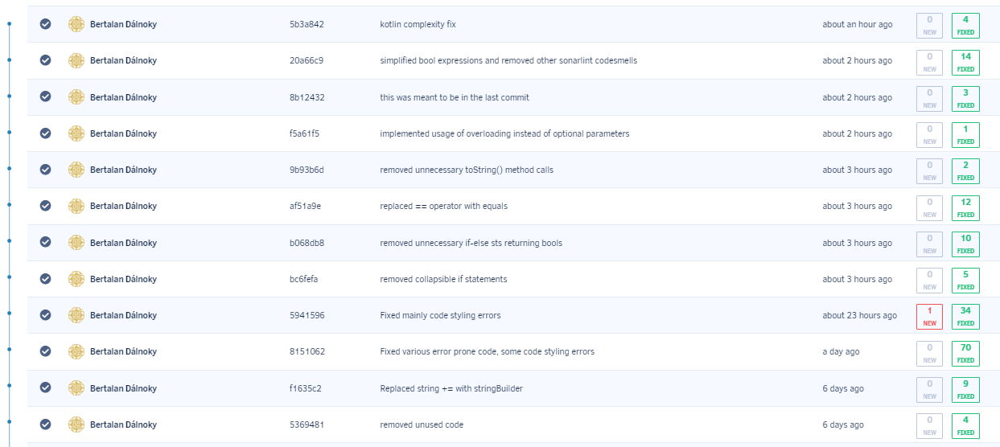
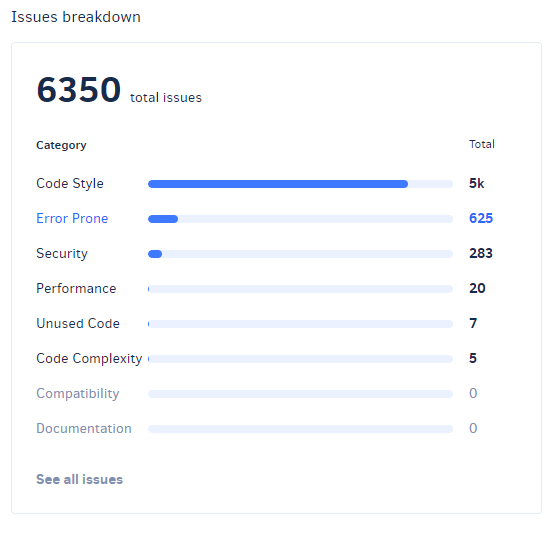

# Statikus analízis
A statikus analízist eredetileg SonarCloud-dal szerettem volna végezni, sajnos azonban Github Actions használatával nem sikerül beüzemelnem a projektre. Ezután mivel a projektben volt TravisCI konfigurációs fájl ezért megpróbáltam azon keresztül működésre bírni a SonarCloudot. A konfiguráció megítélésem szerin sikeres is lett, de ez a próbálkozás egy olyan szerencsétlenségbe futott bele hogy a tanszéki Github organization Travis build-hez használ kreditjei negatívban vannak, így a Travis nem futtat buildet, aminek következtében a SonarCloud ellenőrzése sem fut le.

Ezután a Codacy nevű statikus analízis tool és a SonarLint használata mellet maradtam és ezeknek a hibajelzései alapján próbáltam javítani a kód minőségén.

## Codacy
 - Első lépésben eltávolítottam a nem használt kódok egy részet a kódbázisból

 - Ezután a **Use a StringBuilder instead.** jelzés alapján a C# fájlokban lévő minden előfordulásánál átalakítottam `string+="example"` kódot használó részeket hogy a `StringBuilder` osztály segítségével építsék a stringeket.

 - Következő lépésben a **Rename 'key' which hides the field with the same name.** jelzésű problémákat javítottam, viszont ezen ponton belefutottam abba a hibába hogy elkezdtem triviális kód stílus hibákat javítani, amiből rengeteget jeleznek az analízisek, ezért ezzel egy idő után felhagytam mivel reménytelen minden jelzett hibát kijavítani egy ilyen méretű projektben.

 - Ezután főleg java fájlokban végeztem javításokat olyan kódok refaktorálásával amire a Codacy és SonarLint is találatot dobott. Többek között:
  > Use equals() to compare object references.

  > Avoid unnecessary if..then..else statements when returning booleans

  > These nested if statements could be combined

  > Avoid unnecessary comparisons in boolean expressions

 - Ezeken kívül még a `queue_stream.cs` fájlban lévő két metódust alakítottam át úgy, hogy opciónális paraméter helyett az overload mechanizmust használják

 - Utolsó lépésben egy Kotlin fájlban jelzett komplexitási hibát javítottam a jelzett kód új metódusba való kiszervezésével.

*Commit log*

 

 ## Összfoglalás
Összeségében próbáltam minnél komlexebb jelzett hibákat megoldani de amint az a lenti képen is látható még akkor is van a projektben rengeteg code smell és jelzett hiba ha nem számítjuk bele a triviálisnak mondható kódstílus hibákat.

*Issues overview*

