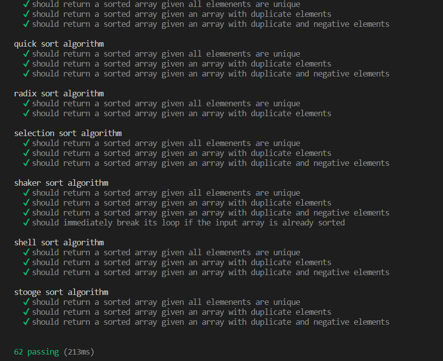
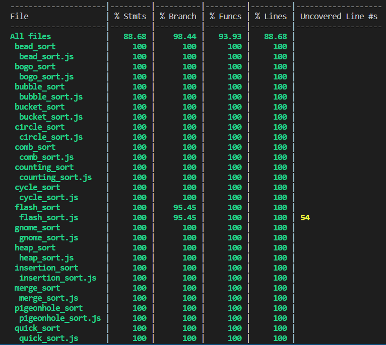
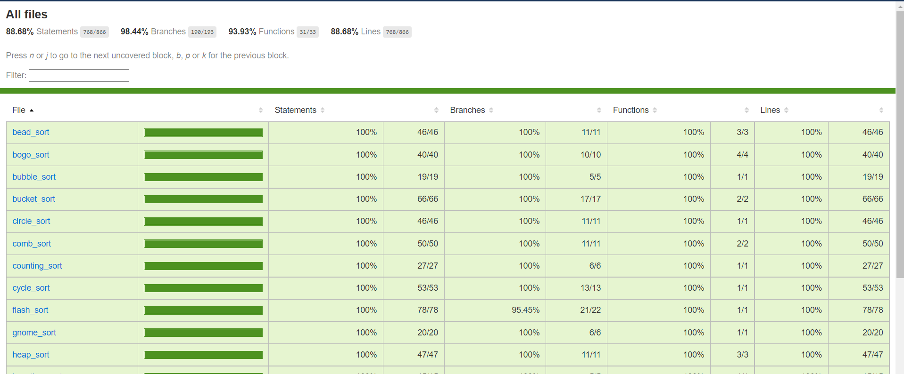

# Unit tesztelés

A unit teszteket JavaScript nyelven írtuk. A tesztelés során a könyvtár 28 sorting algoritmusából, amiből 22-nek van JavaScript implementációja, 20-hoz készültek unit tesztek. A kettő ami kimaradt, azért maradt ki, mert csak jelentősebb módosítás után lettek volna tesztelhetőek.

## Felhasznált eszközök

- Mocha: JavaScript testing framework
- Chai: Assertation library
- c8: Code-coverage

## A tesztek futtatása

A package.json fájlban definiáltunk két scriptet, melyekkel a teszteket lehet futtatni illetve code-coverage-et lehet mérni.

### Tesztek futtatása

`npm run test_sorting`

### Code-coverage mérés

`npm run code_coverage_sorting`

A code-coverage ugyanúgy lefuttatja a teszteket, de utána generál egy reportot a parancssorba illetve a könyvtár coverage nevű mappájába is. A coverage mappában lévő `index.html` fájl megnyitásával láthatjuk a html reportot.

## Tesztesetek

Minden algoritmushoz alapvetően van egy teszt, ami egyedi elemekből álló listával teszteli azt, egy ami duplikát elemekkel, és egy ami pozitív és negatív elemekkel.

Egyes sorting algoritmusok csak természetes számokat tudnak kezelni (pl.: bead sort), ezért azoknak csak két teszteset jutott.

Előfordult olyan algoritmus is, ami code-coverage vizsgálat után nnem ért el 100%-ot, mivel külön kezeli például az üres bemeneti lista esetét, ezért ilyen esetekben egy extre tesztesettel vannak kiegészítve a tesztesetek (pl.: bucket sort).

## Egyedi esetek

A tesztelés során volt egy-két algoritmus ami több figyelmet igényelt mint a többi.

Az egyik ilyen a cycle sort, aminek a könytárban lévő implementációja hibás volt. A függvény végén levő return utasítás eggyel fentebb levő kódblokk végén volt, nem pedig a függvény végén. A problémára a tesztek futtatása során lettünk figyelmesek, a problémát pedig a Cycle sort wikipedia oldalon lévő pszeudokód alapján javítottuk ki.

Kiemelendő még a flash sort, ami a tesztelt algoritmusok közül egyedüliként nem ér el 100%-os lefedettséget. Ennek oka, hogy az algoritmus közepén van egy break utasítás egy if feltételben, ami normális körülmények nem érhető el, illetve nehezen érthető az implementáció alapján, hogy mikor futhatna le egyáltalán az utasítás. Ezen okoból nem vettünk fel külön tesztesetet erre az egy utasításra.
